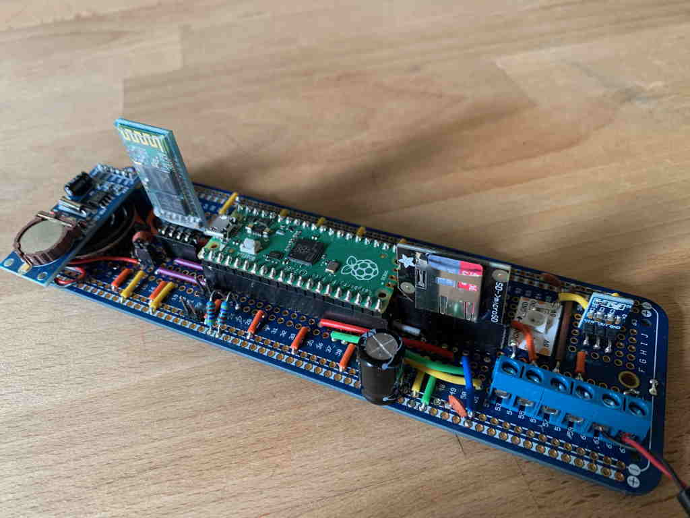
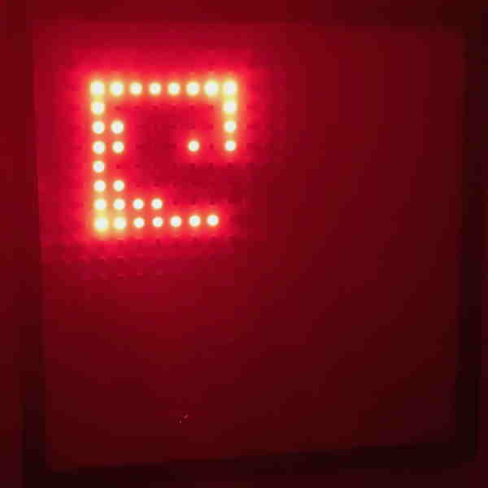

LED Display 3 - Raspberry Pi Pico based driver board with a NeoPixel display

#Using

You'll need Mecrisp Stellaris. You can use the stock 115200 baud serial Pico image, but Peter Jackacki supplied one with 921600 baud here: https://github.com/forth2020/tachyon/tree/main/rp2040/mecrisp (mecrisp-2.61-921600bd.uf2).

You'll need to load TACHYON (you can do this with FL and get the whole thing loaded in a couple of seconds). I'll add instructions later. You might want FRED.FTH editor. Both of these are in the 'Picoforth_Tachyon_Extensions/' folder.

You'll then need to load LED2PICO.FTH from the src/ directory.

#Hardware

The display itself is a 24 x 24 pixel Neopixel (WS2812) based display. 

The controller board is loosely based on the Maker Pi Pico board by Cytron https://www.cytron.io/p-maker-pi-pico - the code will work with other configurations - see TACHYON.FTH for details and custom configuration.

#Current code

Simple test image

#Background

Second LED board, but with new controller board (Rasberry Pi Pico rather than Arduino Nano 33 BLE).

Second Display, Nano 33 BLE controller - ported pForth with flash file system (unpublished)
Second Display, Nano 33 BLE controller, Ardunio (unfinished) https://github.com/robzed/LED_Display
Original Display - One version Forth, Second version Forth plus Python/Rasbperry Pi  https://github.com/robzed/LED_Display

# License

LED display code Copyright (c) 2022 Rob Probin. 
PicoForth/Tachyon Extensions/FRED Copyright (c) 2021-2022 Peter Jackacki.

MIT License - See LICENSE

